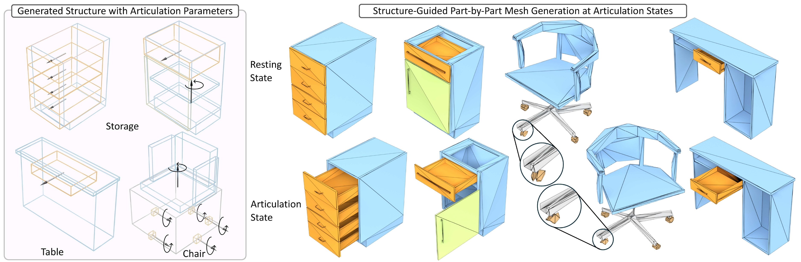

# MeshArt: Generating Articulated Meshes with Structure-Guided Transformers
[](https://arxiv.org/pdf/2412.11596)
[](https://daoyig.github.io/Mesh_Art/)

[Daoyi Gao](https://daoyig.github.io/), [Yawar Siddiqui](https://nihalsid.github.io/), [Lei Li](https://craigleili.github.io/), and [Angela Dai](https://www.3dunderstanding.org/index.html)

MeshArt proposed a hierarchical articulated mesh generation scheme. We first generate a high-level articulation-aware object structure; then, based on this structural information, we synthesize each part's mesh faces. Key to our approach is modeling both articulation structures and part meshes as sequences of quantized triangle embeddings, leading to a unified hierarchical framework with transformers for autoregressive generation.




## Environment

We tested with Ubuntu 20.04, Python 3.8, CUDA 11.8, Pytorch 2.1

### Dependencies

We provide an Anaconda environment with the dependencies, to install run

```bash
conda env create -f env.yml
```
In case errors show up for missing packages, install them manually.

## Available Resources

### Data
We provide our annotated articulated PartNet dataset across 3 major categories: StorageFurniture, Table and Chair. Please see the README inside the data folder with more details.
[articulated PartNet Dataset](https://syncandshare.lrz.de/getlink/fiUmg8eqE9maZZcsguGCKt/data_release)


## Pretrained Checkpoint
We provide the checkpoints for structure VQVAE, structure transformer, geometry VQVAE and geometry transformer [here](https://syncandshare.lrz.de/getlink/fiMrrxYpyshQSHJFys1Tpb/pretrained_models).


## Training

#### Structure VQVAE
```bash
python trainer/train_structure_vqvae.py dataset_root=<path_to_structure_data> batch_size=32 shift_augment=True scale_augment=True wandb_main=True experiment=<experiment_name> val_check_percent=2 val_check_interval=2 overfit=False max_epoch=1000 only_chairs=False use_smoothed_loss=True graph_conv=sage use_point_feats=False num_workers=8 n_embed=4096 num_tokens=131 embed_levels=2 num_val_samples=8 use_multimodal_loss=True weight_decay=0.1 embed_dim=192 code_decay=0.99 embed_share=True distribute_features=True lr=1e-4 min_lr=1e-5 load_part_class_text_feature=<path_to_text_feature> load_class_feature_mapping=<path_to_feature_mapping> load_geometry_features=True geometry_feature_path=<path_to_geometry_feature_ckpt> load_articulation_info=<path_to_articulation_json> load_structure_info=<path_to_structure_json> load_joint_text_feature=<path_to_joint_feature> joint_augment=False joint_augment_val=False
```


#### Structure transformer
```bash
python trainer/train_structure_transformer.py wandb_main=True batch_size=8 gradient_accumulation_steps=4 max_val_tokens=4000 max_epoch=500 sanity_steps=0 val_check_interval=1 val_check_percent=2 block_size=4608 model.n_layer=12 model.n_head=12 model.n_embd=768 model.dropout=0 dataset_root=<path_to_structure_data> scale_augment=True shift_augment=True num_workers=8 experiment=<experiment_name> use_smoothed_loss=True num_tokens=131 vq_resume=<path_to_structureVQVAE_ckpt> padding=0 num_val_samples=1 overfit=False transformer=noembed_structure lr=1e-4 load_part_class_text_feature=<path_to_text_feature> load_class_feature_mapping=<path_to_feature_mapping> injection_offset=10 train_structure_transformer=True load_geometry_features=True geometry_feature_path=<path_to_geometry_feature_ckpt> load_articulation_info=<path_to_articulation_json> load_structure_info=<path_to_structure_json> load_joint_text_feature=<path_to_joint_feature> joint_augment=False joint_augment_val=False ft_category=<category_id> ft_resume=<path_to_pretrained_structure_transformer_ckpt_if_fintuning>
```

#### Geometry VQVAE
```bash
python trainer/train_geometry_vqvae.py dataset_root=<path_to_geometry_data> batch_size=64 shift_augment=True scale_augment=True wandb_main=True experiment=<experiment_name> val_check_percent=1.0 val_check_interval=1 overfit=False max_epoch=800 only_chairs=False use_smoothed_loss=True graph_conv=sage use_point_feats=False lr=1e-4 min_lr=1e-5 num_workers=8 n_embed=16384 num_tokens=131 embed_levels=2 num_val_samples=8 use_multimodal_loss=True weight_decay=0.1 embed_dim=192 code_decay=0.99 embed_share=True distribute_features=True all_parts_per_epoch=True 
```

#### Geometry transformer
```bash
# run over multiple GPUs (recommended GPUs >= 8), if you have a good budget, can use higher gradient_accumulation_steps
python trainer/train_geometry_transformer.py wandb_main=True batch_size=8 gradient_accumulation_steps=4 max_val_tokens=4000 max_epoch=500 sanity_steps=0 val_check_interval=1 val_check_percent=2 block_size=4608 model.n_layer=24 model.n_head=16 model.n_embd=768 model.dropout=0 dataset_root=<path_to_geometry_data> scale_augment=True shift_augment=True num_workers=8 experiment=<experiment_name> use_smoothed_loss=True num_tokens=131 vq_resume=<path_to_geometryVQVAE_ckpt> padding=0 num_val_samples=1 overfit=False transformer=noembed lr=1e-4 min_lr=1e-5 injection_offset=-1 vq_resume_structure=<path_to_structureVQVAE_ckpt> inject_structure=True load_geometry_features=True geometry_feature_path=<path_to_geometry_feature_ckpt>  load_part_class_text_feature=<path_to_text_feature> train_structure_transformer=False load_class_feature_mapping=<path_to_feature_mapping> load_articulation_info=<path_to_articulation_json> load_structure_info=<path_to_structure_json> load_joint_text_feature=<path_to_joint_feature> all_parts_per_epoch=True joint_augment=False joint_augment_val=False junction_augment=True junction_augment_val=False ft_resume=<path_to_pretrained_ckpt> ft_category=<category_id>
```

## Inference
First sampling the articulation-aware structure:
```bash
python inference/infer_structure.py
```

Then use the saved structures to generate part geometries:
```bash
python inference/infer_geometry.py
```

## Citation

If you wish to cite us, please use the following BibTeX entry:

```BibTeX
@InProceedings{gao2025meshart,
  title={MeshArt: Generating Articulated Meshes with Structure-guided Transformers},
  author={Gao, Daoyi and Siddiqui, Yawar and Li, Lei and Dai, Angela},
  booktitle={Proceedings of the Computer Vision and Pattern Recognition Conference},
  year={2025}
}

```
## Acknowledgement
Our code is built on top of [MeshGPT](https://github.com/audi/MeshGPT) codebase.